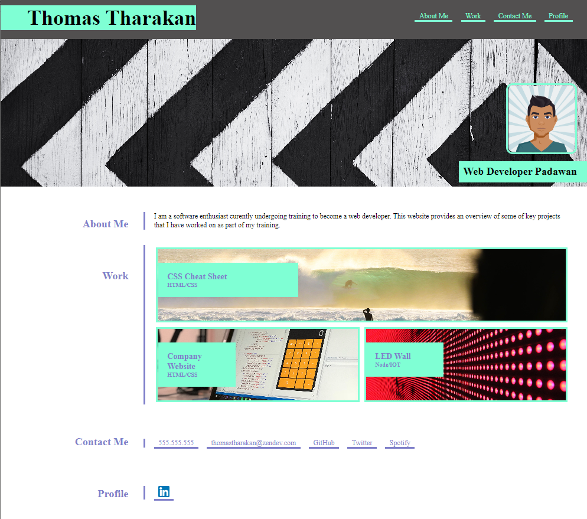

# Thomas Tharakan - Portfolio Website

## Description

This repository ("about-me") contains the code for a static portfolio website. The current website contains a few details about me, my avatar image and links to a few of the projects I have worked on.

The Website is built using html and css and has been optimised with comments and and appropriate use of semantic tags. The site is responsive and has been configured for Desktops (>=900px+), smaller screens (<900px) screens.

Link to hosted site : https://thomasptharakan.github.io/about-me/


## Table of Contents

- [Installation](#installation)
- [Usage](#usage)
- [Credits](#credits)
- [File Structure](#file_structure)
- [Badges](#badges)
- [License](#license)

## Installation

1. Clone the repo
   ```sh
   git clone https://github.com/thomasptharakan/about-me
   
   ```


## Usage

1. Navigate to the cloned folder

2. Open index.html in a browser




## Credits

Base code provide by Edx as part of the bootcamp.


## File_Structure
```

├── assets
│   ├── css
│   │   ├── style.css
│   └── images
│       ├── screen.png
│       ├── linkedin.png
│       ├── cssCheatSheet.png
│       ├── Avatar.png
│       ├── 02-run-buddy.jpg
│       ├── 02-portfolio-4.jpg
│       ├── 02-portfolio-3.jpg
│       ├── 02-portfolio-2.jpg
│       ├── 02-portfolio-1.jpg
│       └── 02-hero-bg.jpg
├── index.html
├── LICENSE
└── README.md
```

## Badges

[](https://code.visualstudio.com/)
[](https://opensource.org/licenses/GPL-3.0/)  


## License

Licensed under the [GPL](LICENSE.txt) license


